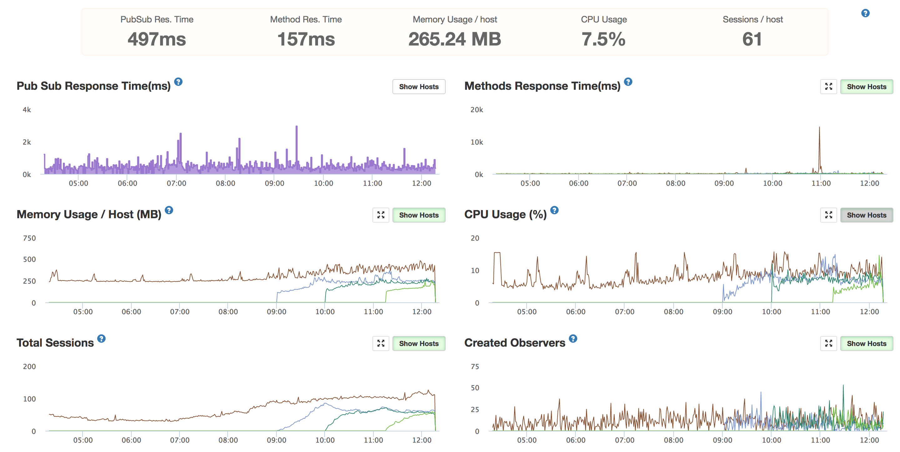
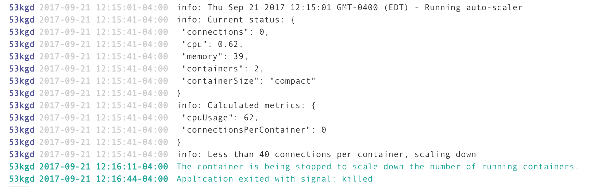
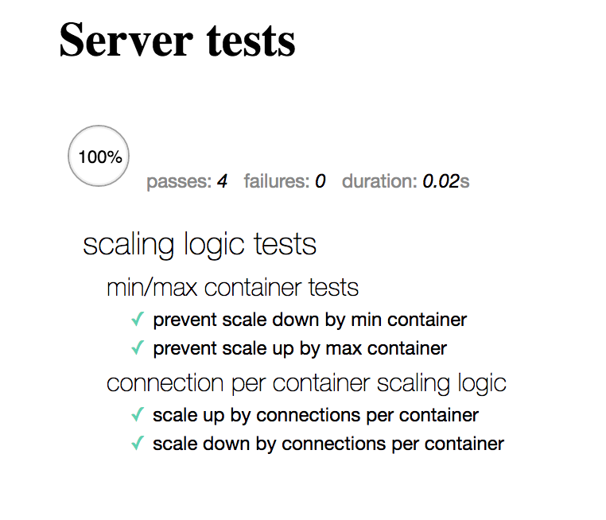

# Depreciated

After updating my Meteor application to 1.6.x, I could not longer get phantom-js and webdriverio running properly to perform scaling operations on Galaxy. I tested using puppeteer as a replacement, and it was running locally but unable to properly start up on Galaxy instances.

Rather than spend additional time working around Galaxy's shortcomings, I transitioned my application to AWS where I'm getting massively better performance at a lower cost. I wrote a [post](https://www.erichartzog.com/blog/aws-vs-galaxy-for-meteor-hosting) on the issues I encountered while transitioning and the overall benefits of being on AWS.

If you still want to use this package, [v2.2.0](https://github.com/jehartzog/galaxy-autoscale/releases/tag/v2.2.0) should still work with Meteor 1.5.x, and I'd be happy to accept PR's and help provide support if someone is still relying on this package, but I am no longer using it myself.

For more discussion see [#4](https://github.com/jehartzog/galaxy-autoscale/issues/4).

---

A package to allow a Meteor app deployed on [Meteor Galaxy](https://www.meteor.com/hosting) to determine current usage and adjust the number of running containers.

Since there is no API to access this information, this package uses phantomjs and webdriverio to scrape the information and interact with the Meteor Galaxy portal.

## Quickstart

Install the package
```
meteor add avariodev:galaxy-autoscale
```

Create the following file somewhere where it will only be loaded on the server
`/imports/server/galaxy-autoscale.js`
```js
import { GalaxyAutoScale } from 'meteor/avariodev:galaxy-autoscale';

Meteor.startup(() => {
  GalaxyAutoScale.config({
    appUrl: Meteor.settings.galaxy.appUrl,
    username: Meteor.settings.galaxy.username,
    password: Meteor.settings.galaxy.password,
    scalingRules: {
      containersMin: 1,
      containersMax: 3,
      connectionsPerContainerMax: 80,
      connectionsPerContainerMin: 40,
    },
    alertRules: {
      cpuPercentageMax: 80,
    },
  });

  GalaxyAutoScale.addSyncedCronJob();

  GalaxyAutoScale.startSyncedCron();
});
```

## Updating to V3.0.0

Phantomjs-prebuilt and webdriverio were removed and replaced by puppeteer. You can remove phantomjs-prebuilt and webdriverio from your existing project, as puppeteer properly works with Npm.depends.

## Screenshots of Auto-Scaling in Action

Galaxy APM graphs of up-scaling with steadily rising connections


Meteor Galaxy log of down-scaling


## Important Note if Already Using Synced-Cron

This package uses [percolate:synced-cron](https://github.com/percolatestudio/meteor-synced-cron) to manage the timing of running the script, along with ensuring the script only gets run once per interval in a multiple-server deployment.

If you are already using `synced-cron` in your app, then do not run `GalaxyAutoScale.start();` as that is simply a wrapper around `SyncedCron.start()`.

## Configuration Information

### appUrl

This should be the entire URL used to access your apps Galaxy management page, such as `https://galaxy.meteor.com/app/www.yourapp.com`.

V2.0.0 and earlier only used `appName`, which assumed `https://galaxy.meteor.com/app/` only allowing the package to work in us-east-1. This was left in for compatibility.

## Scaling logic

Eventually I may add in better CPU/Memory based scaling, but since those numbers are more dynamic, I went with number of connections to start out.

The script does some basic math to calculate stats not provided by the Galaxy page:

- The overall CPU percentage being used (not currently used)
  - Total CPU ECU used / (# of containers * ECU per container)

- The overall connections per container
  - Number of connections / number of containers

### containersMin/containersMax

It will not scale above/below these numbers.

### connectionsPerContainerMax

Once the connections per container reaches this number, it will add a single container.

### connectionsPerContainerMin

Once the connections per container reaches this number, it will remove a single container.

## Scaling Interval

By default it runs every 15 minutes. To change this, add an `interval` value to the config. This `interval` value is passed to `synced-cron` which uses the [later.js](http://bunkat.github.io/later/) library.
```js
GalaxyAutoScale.config({ interval: 'every 15 minutes' });
```

## Manual Scaling Execution

If for whatever reason you want to manually run the auto-scaling script, call `GalaxyAutoScale.runAutoScale()`. Ensure you set your config settings first.

## Logging

By default it will log to console, you can disable logging by setting `GalaxyAutoScale.config({ log: false })`, or you can pass a custom logger in which it will use. For example:

```js
const loggerWrapper = ({ level, message }) => {
  myWinstonLogger.log(level, message);
};

Meteor.startup(() => {
  GalaxyAutoScale.config({
    ...
    logger: loggerWrapper,
  });
  ...
});
```

### alertRules

Basic checks to configure warning log notifications. Currently the only rule created is `cpuPercentageMax`, if the overall cpu percentage used exceeds this, a log even with severity `warn` will be created, allowing for automatic notifications if your log stream is configured for that.

## Troubleshooting

### MUP deployment failure - Insufficient Memory

If you get an error during the MUP deploy process and it's not clear what is going wrong, you probably don't have enough memory on the server to complete the install. When deploying with my relatively small project, the install would fail at the phantomjs install script with a cryptic `137 error` if the server only had 512 MB of memory, it needed at least 1 GB to complete the install.

If you want to run a maintenance server on as small a server as possible, you can deploy to a 1 GB server and then downsize it after the install script is completed. I was able to run this on a 512 MB t2.nano AWS EC2 instance.

## Alternative to running as Meteor package

While working out how to do this, I started with a [standalone scrip](https://github.com/jehartzog/galaxy-phantomjs-autoscale) that can be run on Node. I set up a nano AWS EC2 instance, set the script to run with cron, and it works just fine. If you want to keep this browser scraping script out of your webserver, than you can set it up that way.

After running the script on a Galaxy compact container with zero connections, CPU went to about 90% (0.4 ECU) and memory up by ~90MB for the 30 seconds this was running, so it does cause a brief impact on your webserver. On the other hand, if you are auto-scaling then you should always have some extra capacity, right? :D

## Tests

First ensure dependencies are installed with `npm install` and then run the tests with `npm test`.



## License

MIT
